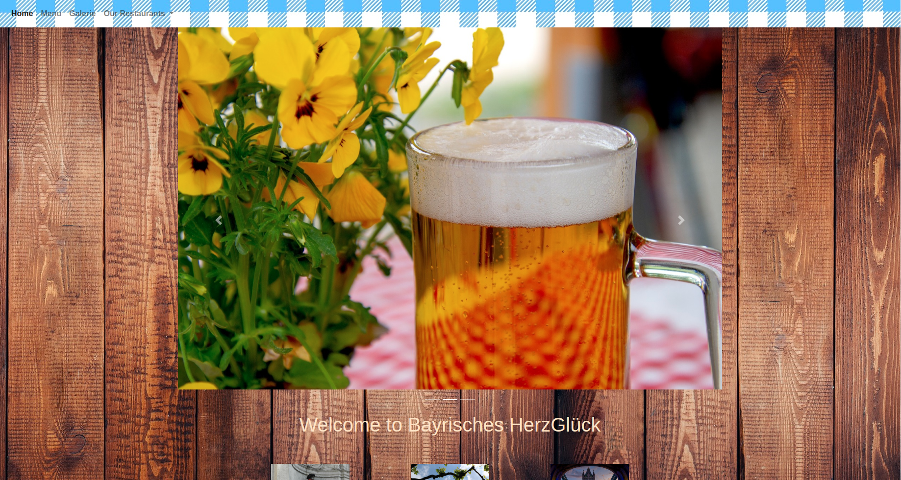

# bootstrap-css-framework

Project to understant working/usage of bootstrap and a large range of its features.

It'a a restaurants web page with main page, menu card, galerie and 3 different locations of the retaurant. For more check out the page ;)

see in action:  https://renkesjanina.github.io/bootstrap-css-framework/.

by:
RENKES Janina - GitHub: RenkesJanina (https://github.com/RenkesJanina)

LinkedIn : https://www.linkedin.com/in/janina-renkes-157727114/

Thanks to...

Mike and Adam. They helped me tu understand bootstrap and debugg my page. Thanks a lot!

